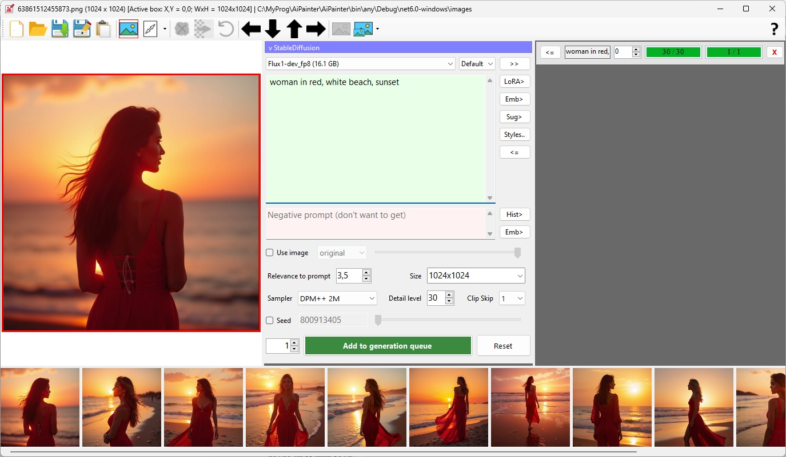
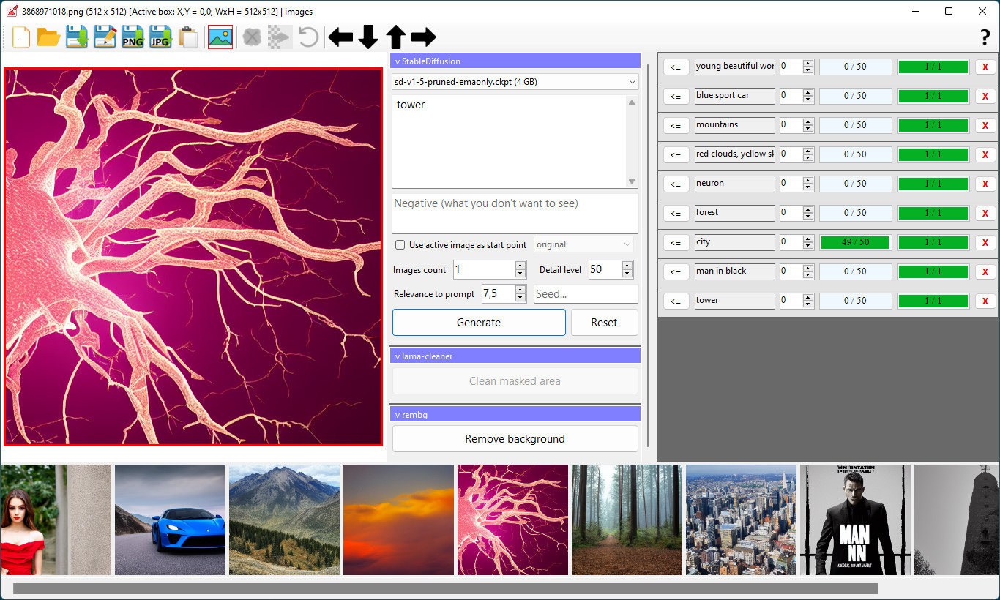
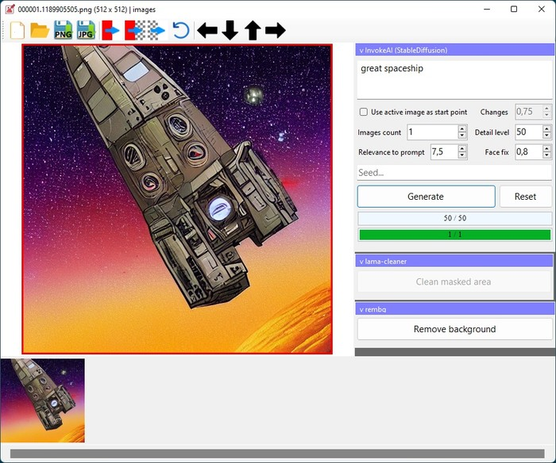
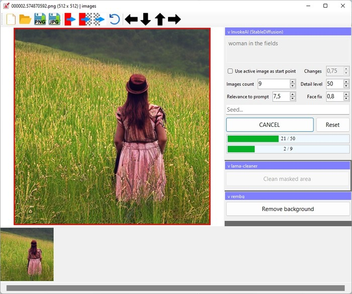
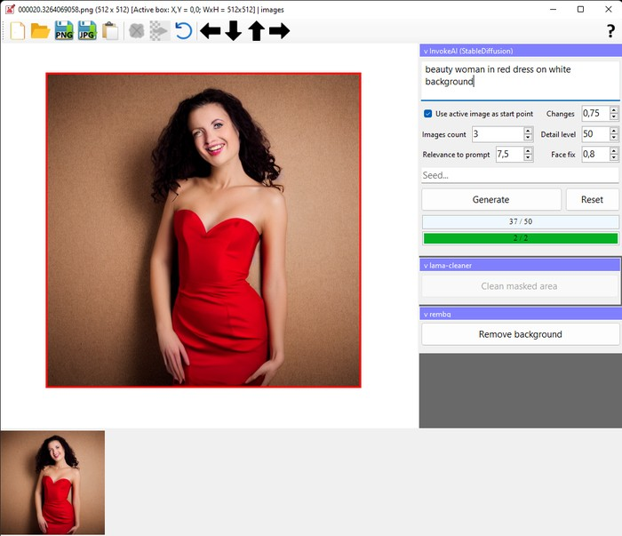
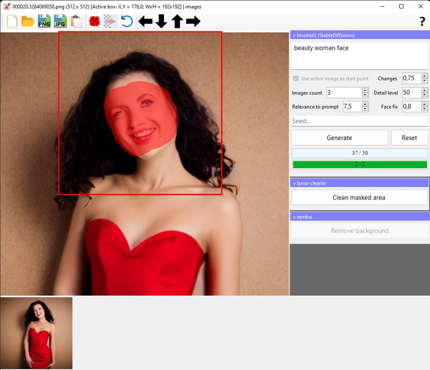

# AiPainter

Digital AI painter. Features:
 
 * generate pictures by text description (generate via [ComfyUI](https://github.com/comfyanonymous/ComfyUI));
 * regenerate specified areas of image (inpaint via [ComfyUI](https://github.com/comfyanonymous/ComfyUI));
 * remove specified objects from pictures (inpaint via [lama-cleaner](https://github.com/Sanster/lama-cleaner));
 * upscale 4x (via models `RealESRGAN_x4+` and `RealESRGAN_x4+_anime_6B`);
 * models import from [CivitAi](https://civitai.com/);
 * modern [Flux](https://civitai.com/models/618692/flux) models support.

## Outpainting (animated gif)

## Requirements

 * Windows 10+ (x64)
 * 16GB RAM
 * NVIDIA video card (4GB VRAM, CUDA 11.4)
 * for Flux: 12GB VRAM, 64GB RAM+swap
 * 20 GB disk space

Tested on NVIDIA RTX 3060.
 

## Using

 * download precompiled AiPainter-3.0.0 from [mega.nz](https://mega.nz/file/hs1FRRgY#V2dWoXhjZ3EEDUUD9F-aKyuzt_fl6FDwc2c1K8ao9eY)
 * unpack
 * run `AiPainter.exe`

## Troubleshooting

 * look into `logs` folder
 * check `Config.json`

## Contribution

 * install [Anaconda](https://docs.anaconda.com/anaconda/install/windows/)
 * install MS Visual Studio Community 2022
 * `git clone git@github.com:yar3333/aipainter.git --recurse-submodules`
 * look into subfolders in `_external` and fix paths in `*.cmd` helpers to conda `envs` directory
 * run `create_conda_env.cmd` helpers to prepare conda environments
 * now you can use `run.cmd` helpers to run python projects
 * open `AiPainter.sln` in Visual Studio and build it
