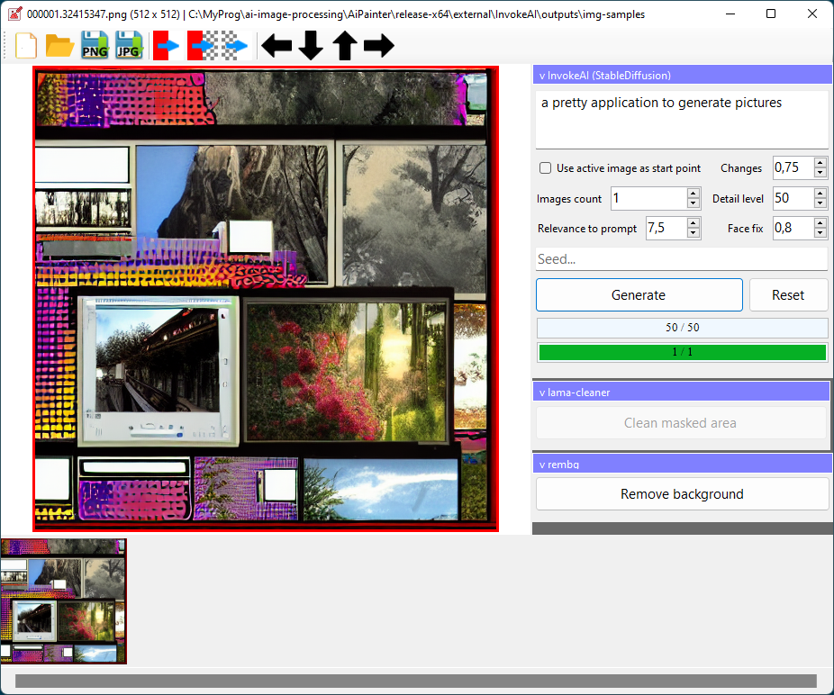

## AiPainter

Digital AI painter. Features:
 
 * generate pictures by text description (generate via [InvokeAI / StableDiffusion](https://github.com/invoke-ai/InvokeAI));
 * regenerate specifed areas of image (inpaint via [InvokeAI / StableDiffusion](https://github.com/invoke-ai/InvokeAI));
 * remove specifed objects from pictures (inpaint via [lama-cleaner](https://github.com/Sanster/lama-cleaner));
 * remove background from pictures (via [rembg](https://github.com/danielgatis/rembg)).

## Requirements

 * Windows 10+ (x64);
 * NVIDIA video card (>4GB RAM);
 * video card must support CUDA 11.4.

Tested on NVIDIA 3060.
 

## Using

 * download [precompiled AiPainter](https://mega.nz/file/5plESYoa#54BX0znDghIIYkd8zePA-xqJyFyoIUVKi7gsVoEHO_c), unpack;
 * download StableDuffision network weights (file `sd-v1-4.ckpt`) from [HuggingFace](https://huggingface.co/CompVis/stable-diffusion-v-1-4-original);
 * save `sd-v1-4.ckpt` as `external\InvokeAI\models\ldm\stable-diffusion-v1\model.ckpt` (path from application's folder).

## Troubleshooting

 * look into `logs` folder;
 * check `Config.json`.

## Contribution

 * install [Anaconda](https://docs.anaconda.com/anaconda/install/windows/);
 * install MS Visual Studio Community 2022;
 * `git clone git@github.com:yar3333/ai-image-processing.git --recurse-submodules`;
 * look into subfolders in `_external` and fix paths in `*.cmd` helpers to conda `envs` directory;
 * run `create_conda_env.cmd` helpers to prepare conda environments;
 * now you can use `run.cmd` helpers to run python projects;
 * open `AiPainter.sln` in Visual Studio and build it.
 
## Donuts

 This project fully free and open-source. You can help the project by sending a [small donut via Tinkoff](https://www.tinkoff.ru/cf/1P754cLgSiB).
